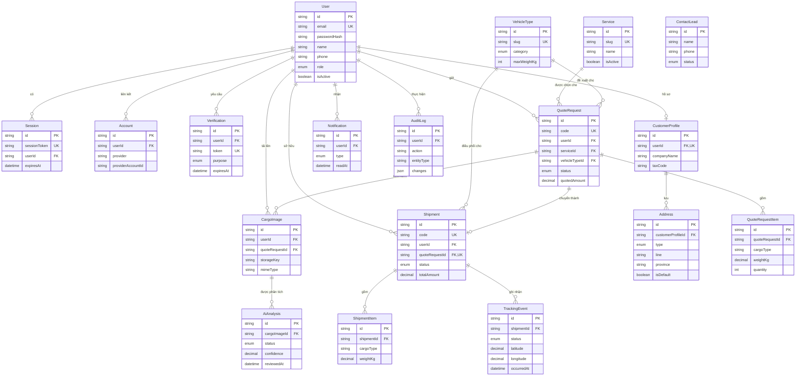

# Kế hoạch database

> **Trạng thái:** Bản nháp schema. Chưa chạy migration, chưa kết nối database thật, chưa có API.
> File schema: [`prisma/schema.prisma`](../prisma/schema.prisma)

## 1. Nguyên tắc thiết kế

- Giao diện được xây trước, nhưng cấu trúc dữ liệu phải chuẩn bị đủ để giai đoạn sau không phải thiết kế lại.
- Mọi số tiền dùng `Decimal` (không dùng `Float`) để tránh sai số khi tính toán chi phí.
- Bảng nghiệp vụ dùng `onDelete: SetNull` với quan hệ tới `User` để không mất dữ liệu lịch sử khi người dùng bị xóa; bảng con phụ thuộc chặt (item, tracking event) dùng `Cascade`.
- Trạng thái dùng `enum` thay vì chuỗi tự do để tránh dữ liệu rác.
- Chưa đưa vào schema: bảng thanh toán, hợp đồng, bảng giá theo tuyến — chờ nghiệp vụ thật từ doanh nghiệp.

## 2. Phân nhóm theo giai đoạn triển khai

| Nhóm | Bảng | Mục đích |
|---|---|---|
| **[AUTH]** Đăng nhập & tài khoản | `User`, `Session`, `Account`, `Verification`, `CustomerProfile`, `Address` | Xác thực, hồ sơ khách hàng, sổ địa chỉ |
| **[SHIPPING]** Vận chuyển | `Service`, `VehicleType`, `QuoteRequest`, `QuoteRequestItem`, `Shipment`, `ShipmentItem`, `TrackingEvent`, `ContactLead`, `Notification` | Danh mục dịch vụ/xe, yêu cầu báo giá, đơn hàng, hành trình, liên hệ, thông báo |
| **[AI]** Ước tính từ ảnh | `CargoImage`, `AiAnalysis` | Lưu ảnh hàng hóa và kết quả nhận diện, luôn kèm bước người xác nhận |
| **[AUDIT]** Nhật ký | `AuditLog` | Lưu vết thao tác thay đổi dữ liệu |

## 3. ERD



## 4. Ghi chú thiết kế theo bảng

### QuoteRequest → Shipment
Quan hệ 1–1 tùy chọn. Một yêu cầu báo giá sau khi được xác nhận sẽ sinh ra đúng một vận đơn. Vẫn cho phép tạo `Shipment` độc lập (đơn nhập tay từ nhân viên) nên `quoteRequestId` để null được.

### TrackingEvent và theo dõi vị trí
`latitude` / `longitude` đã có sẵn để phục vụ tính năng theo dõi vị trí phương tiện. Nguồn dữ liệu có thể là GPS điện thoại tài xế (app driver) hoặc thiết bị định vị gắn xe — quyết định sau, schema không cần đổi.

### AiAnalysis
- `rawResult` (Json) giữ nguyên kết quả thô từ mô hình để đối chiếu khi cần.
- `reviewedByUserId` / `reviewedAt` bắt buộc trong luồng nghiệp vụ: kết quả AI **không** được tự động tin, luôn cần người xác nhận.
- Một ảnh có thể phân tích nhiều lần (đổi mô hình, chạy lại) nên quan hệ là 1–n.

### Giá trị tiền tệ
`quotedAmount`, `totalAmount` dùng `Decimal(14,2)`, kèm cột `currency` mặc định `"VND"` để mở đường cho hợp đồng ngoại tệ sau này.

## 5. Việc chưa làm (giai đoạn sau)

- [ ] Chạy `prisma migrate dev` sau khi có `DATABASE_URL` thật
- [ ] Viết seed data thay thế mock data trong `src/data/mock/`
- [ ] Bổ sung bảng thanh toán / hợp đồng khi có nghiệp vụ thật
- [ ] Bổ sung bảng bảng giá theo tuyến nếu doanh nghiệp áp dụng biểu giá cố định
- [ ] Xác định chính sách lưu trữ và xóa ảnh hàng hóa (retention policy)
- [ ] Rà soát index sau khi có dữ liệu thật và truy vấn thực tế

## 6. Cách chạy kiểm tra schema

```bash
npx prisma format
```

```bash
npx prisma validate
```

Không chạy `prisma migrate` hoặc `prisma db push` ở giai đoạn này.
